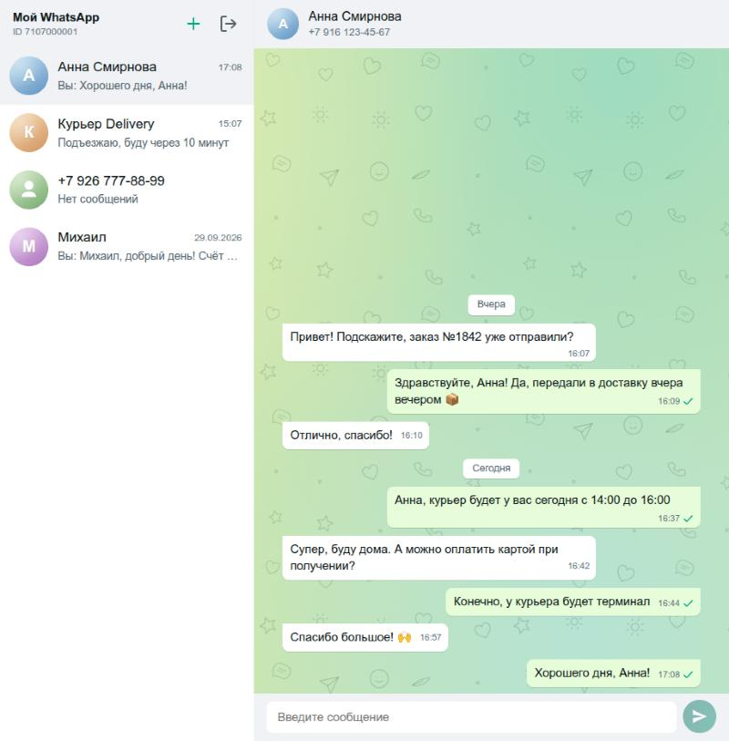
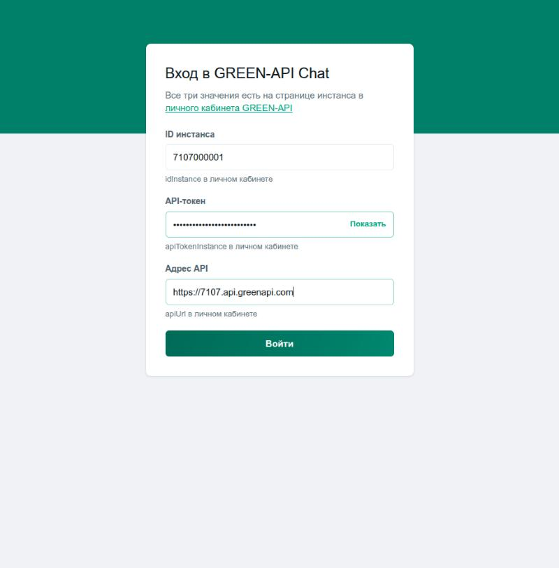
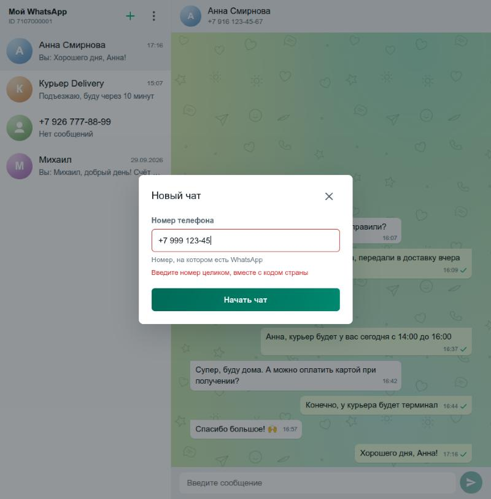
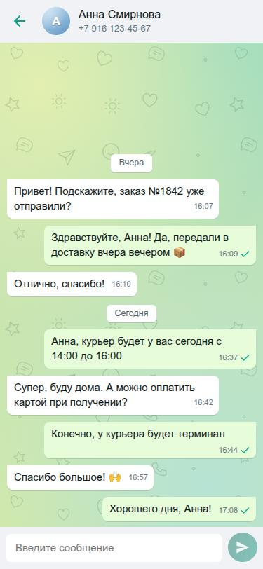

# GREEN-API Chat

Веб-чат для WhatsApp на базе [GREEN-API](https://green-api.com): входите с данными своего инстанса, пишете по номеру телефона и видите ответы собеседника в реальном времени.

Тестовое задание на позицию «Фронтенд-разработчик React».

**Демо:** https://sharymka.github.io/green-api-chat/



| Вход                                | Новый чат                                   | Телефон                                 |
| ----------------------------------- | ------------------------------------------- | --------------------------------------- |
|  |  |  |

## Что умеет

- **Вход** по `idInstance`, `apiTokenInstance` и `apiUrl`. Данные сразу проверяются запросом `getStateInstance`, ошибки объясняются по-человечески.
- **Новый чат** по номеру телефона: номер можно вводить в любом привычном виде — `8 (900) 123-45-67`, `+7 900 123 45 67`.
- **Отправка** текста методом `SendMessage`. Сообщение появляется в ленте сразу (⏱), затем получает отметки, как в WhatsApp: ✓ отправлено, ✓✓ доставлено, голубые ✓✓ прочитано — или кнопку «Повторить», если не ушло.
- **Получение** ответов в реальном времени через HTTP API (`ReceiveNotification` → `DeleteNotification`).
- **История**: после перезагрузки страницы, на следующий день и на другом компьютере чаты на месте (недавние подтягиваются из журнала GREEN-API, открытый чат тоже запоминается), а переписка подгружается через `GetChatHistory`.
- **Проверка настроек инстанса** (`GetSettings`) при входе, при возвращении во вкладку и раз в 5 минут: если уведомления выключены или задан `webhookUrl`, приложение объясняет, почему ответы не приходят, и предлагает исправить настройки одной кнопкой (`SetSettings`).
- **Понятные сообщения о проблемах со стороны GREEN-API**: инстанс отключили от WhatsApp (`stateInstanceChanged`), закончился лимит бесплатного тарифа (`quotaExceeded` — со списком номеров, с которыми ещё можно переписываться), токен перестал подходить (ответ 401 — приложение выходит и объясняет причину на экране входа).
- Меню «⋮» с выходом, как в WhatsApp, плашка «Нет соединения» и автоматическое переподключение, скелетон при загрузке истории, светлая и тёмная тема, вёрстка для телефона.

## Как запустить локально

Нужен Node.js 22.12 или новее (так требуют Vite и Vitest).

```bash
git clone https://github.com/Sharymka/green-api-chat.git
cd green-api-chat
npm ci
npm run dev
```

Приложение откроется на http://localhost:5173/green-api-chat/

Другие команды:

| Команда             | Что делает                         |
| ------------------- | ---------------------------------- |
| `npm test`          | Запускает тесты                    |
| `npm run lint`      | Проверяет код линтером             |
| `npm run typecheck` | Проверяет типы TypeScript          |
| `npm run format`    | Форматирует код (Prettier)         |
| `npm run build`     | Собирает приложение в папку `dist` |

## Как подготовить инстанс GREEN-API

1. Зарегистрируйтесь в [личном кабинете](https://console.green-api.com) и создайте инстанс WhatsApp.
2. Отсканируйте QR-код в WhatsApp на телефоне (**Связанные устройства**). Статус инстанса должен стать `authorized`.
3. В настройках инстанса (после создания все уведомления выключены; приложение подскажет и может включить их само):
   - оставьте **пустым** поле `webhookUrl` — иначе уведомления уйдут на webhook и приложение не получит ответы;
   - включите «Получать уведомления о входящих сообщениях и файлах», «…о сообщениях, отправленных с телефона» и «…о статусах отправленных сообщений» — без них GREEN-API не ведёт журнал и история чатов будет пустой. Настройки применяются до 5 минут.
4. Скопируйте со страницы инстанса `idInstance`, `apiTokenInstance` и `apiUrl` и войдите в приложение.

Для проверки нужен второй номер WhatsApp: на него вы пишете из приложения, с него отвечаете.

## Почему WhatsApp, а не MAX

Задание разрешает сделать чат для WhatsApp, если с MAX не получается. API у GREEN-API для обоих мессенджеров одинаковый, поэтому перейти на MAX можно, поменяв разбор `chatId` (в MAX во входящих приходит внутренний id, а не номер) и список разрешённых доменов. Внешний вид — по мотивам WhatsApp Web, раскладка совпадает с web.max.ru: список чатов слева, переписка справа.

## Как устроено

```
src/
  api/          запросы к GREEN-API и типизированные ошибки
  components/   экраны и компоненты интерфейса (каждый со своим CSS-модулем)
  hooks/        отправка, загрузка истории, фоновый цикл получения
  state/        reducer + Context, хранение данных входа и списка чатов
  utils/        телефон, проверка полей, разбор уведомлений и истории, даты
```

- **Без библиотек состояния и запросов.** Состояния немного, поэтому хватает `useReducer` + Context; для четырёх методов API — небольшой обёртки над `fetch` с таймаутом, отменой и понятными типами ошибок.
- **Получение сообщений — long polling.** Если за время ожидания ничего не пришло, сервер на практике отвечает `408` (в документации — пустой ответ); приложение считает это пустой очередью, а не ошибкой связи. Если сервер ответил «пусто» мгновенно, следующий запрос — не раньше чем через 3 секунды, чтобы не засыпать его запросами. Пока в списке нет ни одного чата, очередь не опрашивается вовсе: уведомления хранятся в GREEN-API сутки и будут забраны позже.
- **Как работает очередь.** `receiveNotification` — «долгий» запрос: если новых уведомлений нет, сервер держит его открытым и отвечает, как только что-то появится. Мы просим ждать до 20 секунд (`receiveTimeout=20`), но на практике сервер отвечает «пусто» примерно через 5 секунд (значение по умолчанию) — то есть запрос уходит раз в ~5 секунд, а новое сообщение всё равно приходит сразу, не дожидаясь конца ожидания. После обработки уведомление удаляется из очереди; если удалить не удалось, оно придёт ещё раз, и повтор отсекается по `idMessage`.
- **Переподключение** с растущей паузой 1 → 2 → 4 … 30 секунд; когда браузер сообщает, что интернет вернулся, пауза прерывается.
- **Хранение.** Данные входа — в `sessionStorage` (исчезают при закрытии вкладки), список чатов — в `localStorage` отдельно для каждого инстанса и дополняется недавними чатами из журналов `LastIncomingMessages` / `LastOutgoingMessages` за неделю — только теми, куда писали из приложения (`sendByApi: true`), а не всеми чатами WhatsApp; поэтому список одинаковый на любом компьютере, сами сообщения у себя не храним — их отдаёт `GetChatHistory`. «Выйти» стирает и то и другое.

Подробное ТЗ с решениями и задачами — в [docs/SPEC.md](docs/SPEC.md).

## Безопасность

- Токен уходит **только на домены GREEN-API**: поле `apiUrl` принимает лишь `https://*.api.greenapi.com` и `https://*.api.green-api.com`. Иначе подменённым адресом можно было бы увести токен.
- **Content Security Policy** в собранном приложении: скрипты только свои, запросы — только к GREEN-API.
- Текст сообщений выводится только как текст, без `dangerouslySetInnerHTML` (защита от XSS).
- В репозитории нет секретов; тесты никогда не ходят в настоящую сеть.

## Доступность

Все поля подписаны, ошибки связаны с полями, всё управляется с клавиатуры (Enter — отправить, Shift+Enter — новая строка, Esc — закрыть окно), новые сообщения и потеря связи озвучиваются скринридером, анимации отключаются при «уменьшить движение». Экраны автоматически проверяются движком axe в тестах.

## Тесты и CI/CD

Vitest + React Testing Library: логика (телефон, проверка полей, разбор уведомлений, reducer), запросы к API, экраны глазами пользователя (клики и ввод), цикл получения с обрывами связи, проверка доступности.

GitHub Actions на каждый push запускает линтер, проверку форматирования, типов, тесты и сборку; после зелёной проверки ветка `main` автоматически публикуется на GitHub Pages.

## Ограничения и как развивать дальше

- **Один пользователь на инстанс.** Очередь уведомлений у инстанса одна: если открыть чат в двух вкладках, они «разберут» сообщения между собой. Для команды менеджеров нужен сервер: он получает уведомления через webhook, хранит переписку в базе и раздаёт её браузерам через WebSocket, а токен GREEN-API знает только он.
- Только текст и только личные чаты — по условию задания.
- Не показываются сообщения, отправленные с самого телефона, пока чат открыт (после перезагрузки они подтянутся из истории).
- **Восстановление чатов на другом компьютере — за последние 7 дней.** Своего сервера нет, поэтому список чатов «восстанавливается по следам» — по журналу сообщений GREEN-API. Период в неделю выбран нами: по умолчанию журнал отдаёт сутки, максимум в документации не указан. Не восстановятся чат, куда из приложения ещё ни разу не писали (создание чата — действие только внутри приложения, GREEN-API о нём не знает), и чат, где последнее сообщение из приложения старше недели. Переписка при этом не теряется: достаточно создать чат по номеру заново, и история подтянется. Полная синхронизация без ограничений — только со своим сервером и базой данных.
- **История — последние 50 сообщений** чата; более старые при прокрутке вверх пока не догружаются.
- **Журнал GREEN-API отстаёт до 2 минут**: если отправить сообщение и сразу перезагрузить страницу, его может ещё не быть в истории. Пока страница открыта, этого не видно — новые сообщения идут через очередь уведомлений.
- Возможные улучшения: кнопка «↓ к новым сообщениям», поиск по чатам, статусы «доставлено/прочитано», подгрузка более старой истории при прокрутке вверх.
